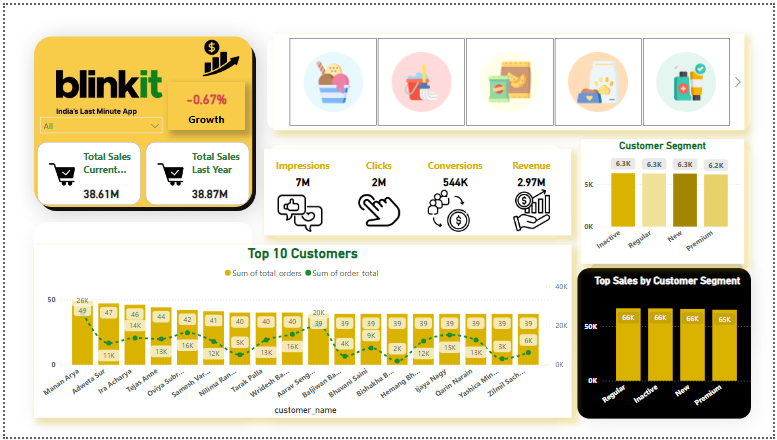

# 🚀 Blinkit Sales and Marketing Dashboard (Power BI)

An interactive Power BI dashboard analyzing **Blinkit’s sales, customer behavior, and marketing performance**.  
This report provides insights into total sales, growth rate, and customer segmentation — helping businesses make data-driven decisions.

---

## 📊 Project Overview

The dashboard visualizes Blinkit’s performance metrics and KPIs across different business aspects:
- Sales comparison between current and last year  
- Marketing funnel performance (Impressions → Clicks → Conversions → Revenue)  
- Customer segmentation and satisfaction  
- Top-performing customers and product categories  

---

## 🎯 Objectives

- Evaluate sales growth and year-over-year (YoY) performance  
- Analyze customer segments and purchasing trends  
- Identify top-performing customers  
- Visualize marketing impact using funnel metrics  

---

## 🧩 Key Metrics

| Metric | Description |
|--------|--------------|
| Total Sales | 38.6M (Current Year) vs 38.8M (Last Year) |
| Impressions | 7M total |
| Clicks | 2M total |
| Conversions | 544K successful orders |
| Revenue | 2.97M total |
| Growth | -0.67% YoY |
| Customer Segments | New, Regular, Inactive, Premium |

---

## 🖼️ Dashboard Preview

| Overview | Sales & Growth | Customer Insights |
|-----------|----------------|------------------|
|  |  |  |

Each page focuses on different aspects:
1. **Overview** – KPIs and yearly sales comparison  
2. **Sales & Growth** – Top customers and total orders  
3. **Customer Insights** – Segment performance and feedback analysis  

---

## 🛠️ Tools Used
- **Power BI**
- **DAX Functions**
- **Data Cleaning (Excel)**
- **Time Intelligence Metrics**

---
## 👩‍💻 Author
**Rania Sami Mohamed Elwan**  
_Data Analyst | Power BI | SQL | Excel_
